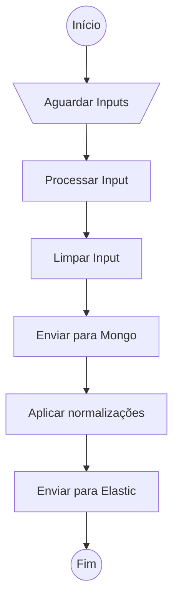
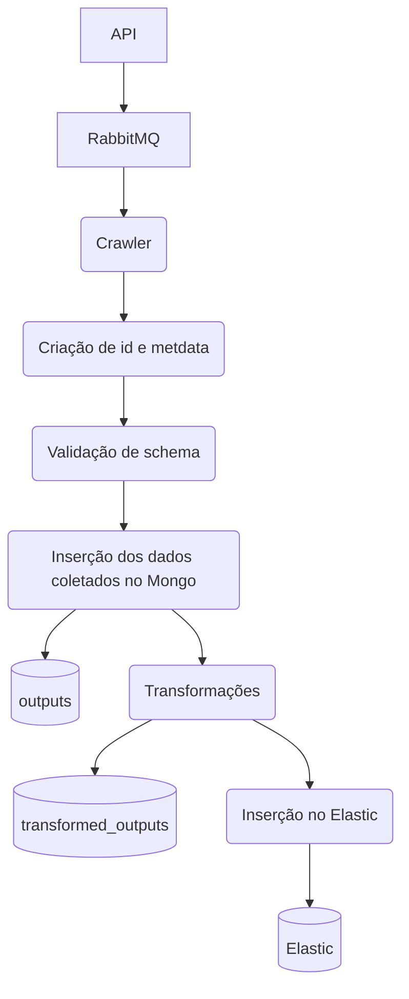

# Base Crawler

This project implements the a scrapy project with the base spider class which all spiders will inherit from. Also, it implements the scrapy pipelines to validate the yielded items, to save the items to a MongoDB database and to send the items to an Elasticsearch database.

The middlewares are the scrapy defaults, and the item class is not used. The items yielded by the spiders which inherit from the base spider **must be** `dict` objects.

The spiders that inherit from this base class should receive the input parameters (e.g.: date range) as kwargs when the crawler is executed.

This project executes unit tests for the pipelines and the helper modules, and it executes integration tests simulating different spider scenarios.

## Requirements

The connection parameters to Mongo, Rabbit and Elastic, such as connection URL, port, username and password must be passed as environment variables to the container when this project is run. For more information, check docker-compose.yml file.

The Python packages required to run this project are locked in the `requirements.txt` file

## Contribution

You may contribute to this project by adding more tests to simulate even more scenarios and by adding more features or modules to be used by other crawlers.

If a new unit test or integration test is added, it is strongly recommended to view the bash scripts in the scripts folder to validate whether the newly created tests are being iterated by the scripts. If they are not being iterated, you may add the folder to the script.

## How to run

This project uses docker containers, so that the developer does not need to have MongoDB and RabbitMQ installed in the host machine. A Makefile exists to make it easy to run.

### Makefile commands

- `make image`: build the image for the container that runs this project.
- `make run-unit-tests`: builds the image and runs the unit tests.
- `make run-integration-tests`: builds the image and runs the integration tests, which simulate different spider cenarios.
- `make run`: builds the image and runs the project. In this mode, the crawler waits for an input as a message coming from RabbitMQ

## How to use the BaseSpider

First, you should build the image for this project. Then, you may create another project using the `FROM base-crawler` clause in the beginning of the Dockerfile of this new project.

This new project should be organized as follows:

- A directory containing a spider
- A directory containing the tests
- The spider should be copied to the /app/base_crawler/spiders directory in the container
- The tests should be copied to the /app/tests/integration or /app/tests/unit directories in the container, according to the test type.
- The expected files **must** be in the /app/tests/files/tests_files directory.
- The entrypoint should execute the `run_crawler` script, that runs the crawler by passing the required parameters for this script

### The `run_crawler.py` script

The `run_crawler.py` script should be the entrypoint of your crawler. You should execute this file as follows:

`python run_crawler.py -name=your-spider-name`

The integration test for the `run_crawler.py` script tests if the inputs were inserted to the expected queues. The whole flow for the crawling mechanism may be tested, and currently this test is manual, not automated. This manual test flow is described below:

1. Make the image for the base-crawler by running the command `make image` in this repository.
2. Initiate the crawler-api with `make run`.
3. In your crawler repository, execute the command `make run-full-test`. You may edit the `docker-compose-full-test.yml` file according to your needs.

## The crawler input

The input to a crawler should be sent mainly by running the crawler api and sending to the appropriate spider. The input should be sent as a dictionary with its respective keys and values.

## Pipeline flow

The pipeline flow is described in the image below.

Also, the following image describes the ETL flow. It may be better visualized inside the docs folder.

First, the crawler waits for an input sent via a RabbitMQ queue. Then, the input is processed, cleaned and sent to Mongo. Normalizations are applied and the result is sent to Elastic.

### ETL explanation (focus on TL)

The steps applied to the yielded data are in the pipelines folder. The order which these steps are applied are defined in the `settings.py` file in the variable `ITEM_PIPELINES`. Lower numbers indicate that the pipeline is executed prior to another.

Each pipeline must implement the method process_item and it must return an item. This item is used as input to the next pipeline in the defined flow.

#### ItemPreparePipeline

An id is created, metadata is added to the item and the strings are converted to uppercase. 

_id, metadata, strings containing urls, strings related to downloaded file information and "ementa" key are not converted to uppercase.

This pipeline cleans the item by calling a function recursively until a string is found. Then, it is converted to uppercase.

This step also checks if the required_keys defined in your spider are present in the yielded item.

#### SchemaValidationPipeline

The schema is validated with the `schemas/common-bot-schema.json` schema. The required keys are validated once again and types for values are validated.

All crawlers use the same schema. It's located in `schemas/common-bot-schema.json` file. This schema is validated. If there are validation errors, an exception is raised and the item is dropped, so it does not continue to flow in the pipeline.

#### MongoPipeline

The resulting item is saved to mongo. If an item needs to be reprocessed at some point, it may be recovered from the Mongo Database at this point. It is not the original item from the crawler because it has _id, metadata and strings converted to uppercase, but it is a pretty useful data for reprocessing and recovery purposes.

#### TransformerPipeline

Currently, this pipeline applies only the rapporteur (relator) transformation.

The normalized result is put in the `"relatorTreated"` field. The `"relator"` key is normalized based on the court. The following strings are prepended depending on the court type:

- DES. FED. if the court is TRF
- MIN. if the court is STF, STJ, TST or TSE
- DES. otherwise

Then, this resulting normalized data is sent to the Elasticsearch database.

#### ElasticPipeline

This pipeline prepares the item for the Elasticsearch database by adding it to a `"doc"` key, and the item is saved in Elasticsearch.